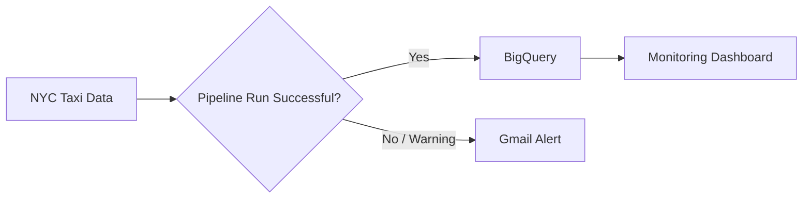

# Reliable NYC Taxi Data Platform

An automated monthly data pipeline that collects NYC taxi data, checks its quality, loads it into BigQuery, alerts when something fails, and provides a dashboard to monitor the result.

## Executive Summary

<table>
  <tr>
    <td width="18%"><strong>Problem</strong></td>
    <td>Monthly taxi data needs to be downloaded, checked, and loaded repeatedly. This process can fail, create duplicate data, or break when the source changes.</td>
  </tr>
  <tr>
    <td width="18%"><strong>Why It Matters</strong></td>
    <td>If those problems go unnoticed, analysts may work with incomplete, duplicated, or outdated data. Manual checking also adds repetitive work every month.</td>
  </tr>
  <tr>
    <td width="18%"><strong>Solution</strong></td>
    <td>Built an automated pipeline that downloads new data, validates it, safely updates BigQuery, handles expected source changes, sends Gmail alerts when a run fails, and updates a monitoring dashboard.</td>
  </tr>
</table>

## Results

### Measured Metrics

| Metric | Result |
|---|---:|
| Pipeline Execution | 3 months of data processed with 0 failed runs |
| Rows Ingested | 11.31 million rows |
| Data Anomaly Flags Detected | 72,392 anomalies |
| Files Ingested | 6 files |

### Key Capabilities

- **Automated data pipeline** — collects, checks, and loads new NYC taxi data into BigQuery with minimal manual work
- **Safe data updates** — prevents duplicate records when the same data is processed again
- **Built-in data quality checks** — stops problematic loads and flags unusual records for investigation
- **Automatic failure handling** — retries temporary failures and sends Gmail alerts when a pipeline run has a problem
- **Interactive monitoring dashboard** — shows data loads, processing volume, and detected data-quality issues in one place

The dashboard gives a quick view of whether the pipeline is working and what data was loaded.

Users can:

- See how many files and rows have been ingested
- Check the latest successful load
- Compare Yellow and Green taxi data volume
- See how many data-quality issues were flagged in each file
- Investigate issue types such as negative amounts, negative trip duration, and zero-fare trips
- Filter the dashboard by file, taxi type, and load date

> The 72,392 anomaly flags are rule-based checks that highlight records worth investigating. A flagged record is not automatically an invalid record.

## Architecture

In simple terms:

1. New taxi data is collected automatically each month.
2. The pipeline checks the data before adding it to the main dataset.
3. Valid data is safely loaded into BigQuery.
4. If the process fails, an email alert is sent automatically.
5. The dashboard shows what was loaded and where potential data-quality issues exist.

## Technical Documentation

For detailed explanation about how the project is built, configured, and run:

[Read Technical Documentation here](TECHNICAL.md)
