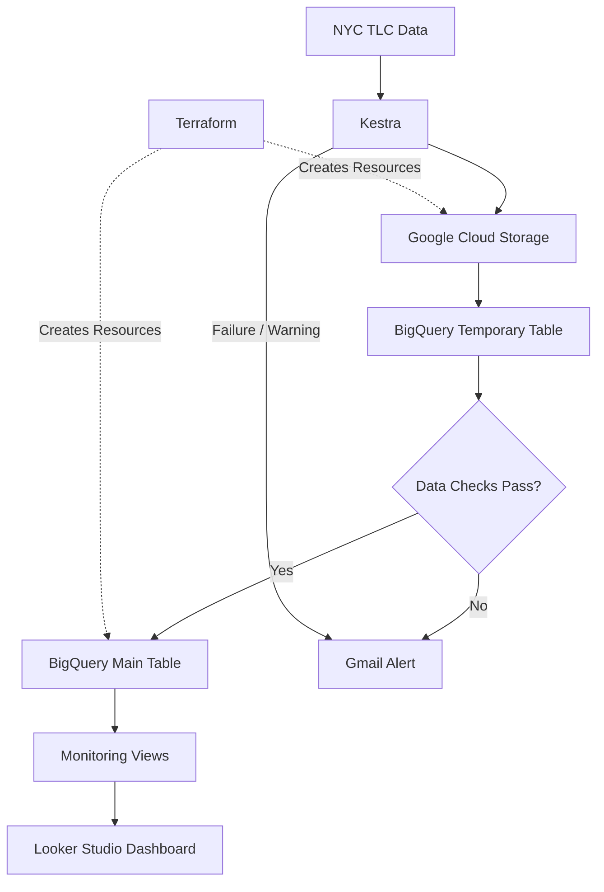

# Reliable NYC Taxi Data Pipeline — Technical Documentation

This document explains how the automated NYC Taxi data pipeline is built,
configured, and run.


## Data Sources

The project uses public data from the
[NYC Taxi & Limousine Commission](https://www.nyc.gov/site/tlc/about/tlc-trip-record-data.page).

| Data | Format | Purpose |
|---|---|---|
| Yellow Taxi Trip Data | Parquet | Monthly Yellow Taxi transactions |
| Green Taxi Trip Data | Parquet | Monthly Green Taxi transactions |
| Taxi Zone Lookup | CSV | Location names and service zones |

## Usage

### Prerequisites

- Python 3.12+
- [uv](https://docs.astral.sh/uv/)
- Docker
- Terraform >= 1.5
- Google Cloud project with billing enabled
- Google Cloud CLI (`gcloud`)
- `jq` and `curl`
- Gmail App Password *(optional, for email alerts)*

#### Authenticate with Google Cloud:

```bash
gcloud auth application-default login
````

### 1. Clone the Repository:

```bash
# Clone the repo
https://github.com/rajatm17/NYC-Taxi-Data-Pipline.git
cd NYC-Taxi-Data-Pipeline

# Install dependencies
uv sync --locked

# Move into this project
cd 02-workflow-orchestration
```

### 2. Provision Google Cloud Resources

```bash
cd terraform

cp terraform.tfvars.example terraform.tfvars
# Fill in project_id, bucket_name, dataset_id, etc.

terraform init
terraform apply
```

Terraform creates the main cloud resources used by the project:

* Google Cloud Storage bucket
* BigQuery dataset
* Kestra service account
* Required access permissions

### 3. Configure the Environment

```bash
cd ..

cp .env.example .env
cp .env.secrets.example .env.secrets
```

Add the required GCP, Kestra, and optional Gmail settings.

### 4. Prepare Secrets

```bash
./scripts/encode_secrets.sh
```

This prepares the sensitive values used by the local Kestra environment.

### 5. Start Kestra

```bash
docker compose up -d
```

Kestra is available locally at:

```text
http://localhost:18081
```

The port can be changed through the environment configuration.

### 6. Load Project Configuration

```bash
./scripts/bootstrap_env.sh
```

This sends the Terraform outputs and project configuration to Kestra.

### 7. Run the Pipelines

The pipelines can be started manually from Kestra or run on their monthly
schedule.

| Pipeline    | Schedule                      |
| ----------- | ----------------------------- |
| Taxi Zone   | 5th of every month, 08:00 UTC |
| Green Taxi  | 5th of every month, 09:00 UTC |
| Yellow Taxi | 5th of every month, 10:00 UTC |

The dashboard data is refreshed after the taxi pipelines complete.

### Teardown

Stop the local environment:

```bash
docker compose down -v
```

Remove the Google Cloud resources:

```bash
cd terraform
terraform destroy
```

## Repository Structure

```text
02-workflow-orchestration/
├── docker-compose.yml
├── .env.example
├── .env.secrets.example
│
├── flows/
│   ├── 00_environment_setup.yaml
│   ├── 01_taxi_tripdata_pipeline.yaml
│   ├── 02_taxi_zone_pipeline.yaml
│   ├── 03_proof_views_pipeline.yaml
│   └── 99_monitoring_alerts.yaml
│
├── scripts/
│   ├── bootstrap_env.sh
│   └── encode_secrets.sh
│
├── terraform/
│   ├── main.tf
│   ├── outputs.tf
│   ├── variables.tf
│   └── terraform.tfvars.example
│
├── proof/
│   ├── proof_export.pdf
│   
│
├── README.md
└── TECHNICAL.md
```

| Path           | Purpose                                                |
| -------------- | ------------------------------------------------------ |
| `flows/`       | Kestra workflows for ingestion, monitoring, and alerts |
| `scripts/`     | Automates environment and secret configuration         |
| `terraform/`   | Creates the required Google Cloud resources            |
| `proof/`       | Dashboard preview and project output                   |
| `README.md`    | Recruiter-facing project overview                      |
| `TECHNICAL.md` | Technical setup and implementation details             |


## Architecture



In simple terms:

1. **Kestra downloads** the latest taxi data from NYC TLC.
2. The source file is stored in **Google Cloud Storage**.
3. The data is first loaded into a temporary BigQuery table.
4. Basic checks verify that the load is not empty and does not contain
   duplicate generated IDs.
5. Valid records are added to the main BigQuery table.
6. Temporary tables are removed after processing.
7. Monitoring data is exposed through the dashboard.
8. Failed or warning pipeline runs trigger a **Gmail alert**.

## Technical Notes


### Key Learnings

| Concept | What I Learned |
| :---: | :--- |
| **Safe Reruns** | A generated `unique_row_id` combined with BigQuery `MERGE` prevents the same records from being inserted again during reruns or backfills. |
| **Data Quality Checks** | SQL checks stop the pipeline when a load is empty or contains duplicate IDs instead of allowing the problem to reach the main table. |
| **Handling Source Changes** | `ADD COLUMN IF NOT EXISTS` allows expected new source columns to be added without rebuilding the table. |
| **Kestra Templates** | Complex template expressions are easier to maintain when intermediate values are declared as variables first. |
| **Scheduled Runs** | Concurrency settings can block a scheduled execution, so trigger and execution state should be checked when debugging schedules. |

